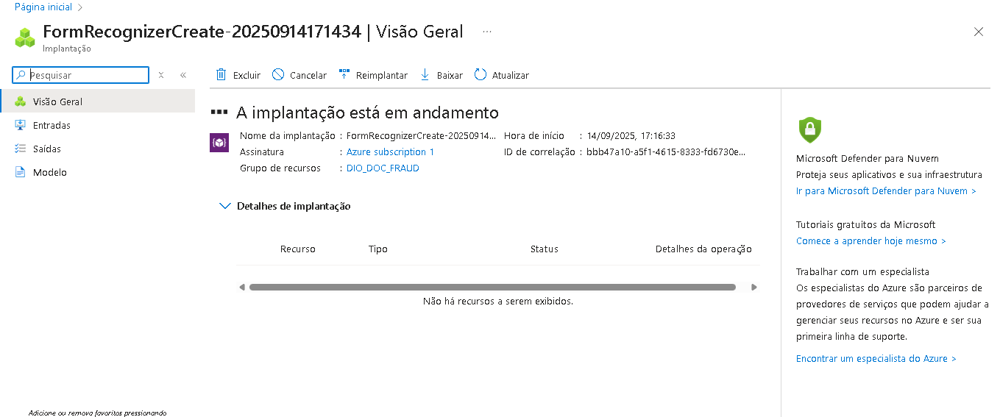
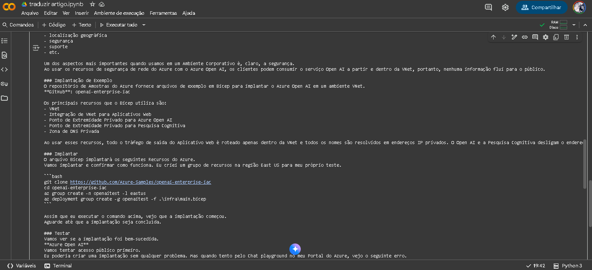

# Projetos do Bootcamp Microsoft AI102 com a DIO

Este repositório contém os projetos desenvolvidos durante o Bootcamp Microsoft AI102, uma iniciativa da DIO em parceria com a Microsoft, focada no desenvolvimento de soluções de Inteligência Artificial no Azure. Os projetos demonstram a aplicação prática dos conhecimentos adquiridos sobre serviços de IA do Azure, como Visão Computacional, Processamento de Linguagem Natural e Armazenamento de Blobs.


## Projeto 1: Análise de Documento Anti Fraude (Extração de Dados de Cartão de Crédito)

Este projeto demonstra a utilização de serviços de IA do Azure para extrair informações de cartões de crédito a partir de imagens, visando a detecção de fraudes ou a automação de processos. A aplicação utiliza o Streamlit para uma interface de usuário interativa, permitindo o upload de imagens de documentos que contêm dados de cartão de crédito.




### Tecnologias Utilizadas:
- **Azure Blob Storage**: Para o armazenamento seguro das imagens dos documentos.
- **Azure AI Vision (OCR)**: Para a extração de texto e reconhecimento de entidades (como números de cartão de crédito, nomes e datas de validade) a partir das imagens.
- **Streamlit**: Para a construção da interface web interativa, facilitando o upload de arquivos e a visualização dos resultados da análise.
- **Python**: Linguagem de programação principal para o desenvolvimento da lógica da aplicação e integração com os serviços Azure.

### Funcionalidades:
- Upload de imagens (PNG, JPG, JPEG) de documentos.
- Envio automático das imagens para o Azure Blob Storage.
- Extração de número de cartão de crédito, nome do titular, data de validade e bandeira do cartão utilizando serviços de IA.
- Exibição dos dados extraídos na interface do usuário.

### Como Funciona:
1. O usuário faz o upload de uma imagem contendo um cartão de crédito através da interface do Streamlit.
2. A imagem é enviada para um contêiner no Azure Blob Storage.
3. A URL da imagem no Blob Storage é utilizada para chamar um serviço de IA (provavelmente Azure AI Vision) que realiza o OCR e a análise da imagem para identificar e extrair os dados do cartão de crédito.
4. Os dados extraídos são apresentados ao usuário na aplicação Streamlit.


## Projeto 2: Tradução de Artigo e Tradutor OpenAI

Este projeto explora a capacidade de tradução de texto utilizando serviços de Inteligência Artificial, com foco na tradução de artigos e na integração com a API da OpenAI para funcionalidades de tradução avançadas. O projeto demonstra como processar texto para tradução e como utilizar modelos de linguagem para obter traduções precisas e contextualmente relevantes.




### Tecnologias Utilizadas:
- **Azure AI Language (Translator)**: Para a tradução de texto entre diferentes idiomas.
- **OpenAI API**: Para a utilização de modelos de linguagem avançados para tradução e possivelmente outras tarefas de processamento de linguagem natural.
- **Python**: Linguagem de programação para a implementação da lógica de tradução e integração com as APIs.
- **Jupyter Notebooks (.ipynb)**: Para o desenvolvimento e experimentação interativa dos códigos de tradução (`traduzir_artigo.ipynb` e `tradutoropenai.ipynb`).

### Funcionalidades:
- Tradução de conteúdo de artigos de um idioma para outro.
- Integração com a API da OpenAI para tradução e possíveis melhorias na qualidade da tradução.
- Demonstração do uso de diferentes serviços de tradução de IA.

### Como Funciona:
1. O projeto recebe um texto de entrada (simulando um artigo).
2. Utiliza o serviço Azure AI Language Translator ou a API da OpenAI para realizar a tradução do texto para o idioma desejado.
3. O resultado da tradução é apresentado, permitindo a verificação da qualidade e fluidez do texto traduzido.


## Aprendizados e Certificação AI-102

O Bootcamp Microsoft AI102 com a DIO proporcionou uma imersão profunda no ecossistema de IA do Azure, cobrindo tópicos essenciais para o desenvolvimento de soluções inteligentes. Os principais aprendizados incluem:

- **Visão Computacional**: Implementação de soluções de processamento de imagem, reconhecimento facial, detecção de objetos e OCR utilizando Azure AI Vision.
- **Processamento de Linguagem Natural (PLN)**: Construção de aplicações para análise de texto, tradução, reconhecimento de fala e compreensão de linguagem com Azure AI Language e Speech Services.
- **Machine Learning no Azure**: Utilização do Azure Machine Learning para construir, treinar e implantar modelos de ML.
- **Azure Cognitive Services**: Exploração e aplicação de diversos serviços cognitivos pré-construídos para adicionar inteligência a aplicações.
- **Armazenamento de Dados para IA**: Gerenciamento de dados para soluções de IA utilizando Azure Blob Storage e outros serviços de armazenamento.
- **Desenvolvimento de Soluções de IA**: Boas práticas e arquiteturas para o desenvolvimento e implantação de soluções de IA escaláveis e robustas no Azure.

Este bootcamp é um preparatório para a certificação **Microsoft Certified: Azure AI Engineer Associate (AI-102)**, que valida a capacidade de projetar e implementar soluções de IA no Azure. Os projetos desenvolvidos neste repositório são exemplos práticos dos conhecimentos e habilidades adquiridos para essa certificação.


## Como Executar os Projetos

Para executar os projetos localmente, siga os passos abaixo:

1. **Clone o repositório:**
   ```bash
   git clone https://github.com/shakarpg/azure_AI.git
   cd azure_AI
   ```

2. **Configure as variáveis de ambiente:**
   Crie um arquivo `.env` na raiz do projeto com suas credenciais do Azure para os serviços utilizados (Azure Blob Storage, Azure AI Vision, Azure AI Language, OpenAI API, etc.). Exemplo:
   ```
   AZURE_STORAGE_CONNECTION_STRING="DefaultEndpointsProtocol=https;AccountName=..."
   AZURE_BLOB_CONTAINER_NAME="meucontainer"
   AZURE_VISION_ENDPOINT="https://minhavisao.cognitiveservices.azure.com/"
   AZURE_VISION_KEY="suachave"
   OPENAI_API_KEY="suachaveopenai"
   ```
   *Nota: As variáveis de ambiente exatas podem variar dependendo da configuração dos serviços no projeto.* 

3. **Instale as dependências:**
   ```bash
   pip install -r requirements.txt
   ```

4. **Execute o Projeto de Análise de Documento Anti Fraude (app.py):**
   ```bash
   streamlit run app.py
   ```
   Abra o navegador e acesse a URL fornecida pelo Streamlit.

5. **Execute os Projetos de Tradução (Jupyter Notebooks):**
   Inicie o Jupyter Notebook na raiz do projeto:
   ```bash
   jupyter notebook
   ```
   Abra e execute os notebooks `traduzir_artigo.ipynb` e `tradutoropenai.ipynb` para explorar as funcionalidades de tradução.


